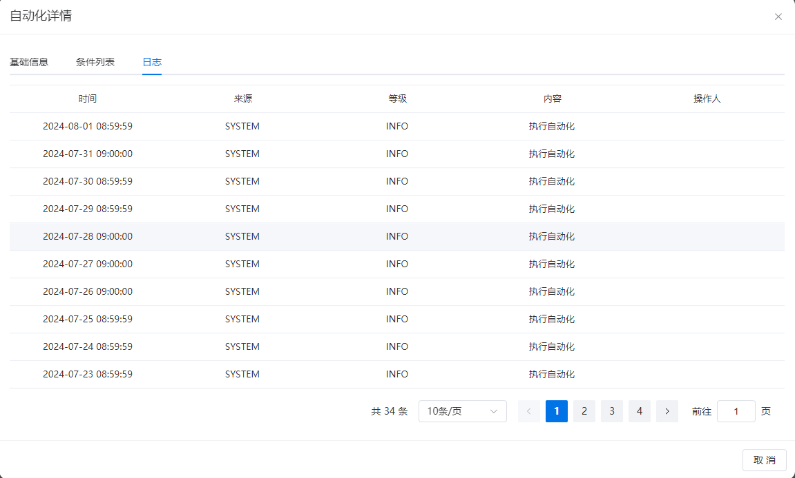

# 自动化
自动化是利用计算机和先进技术，在特定条件或事件发生时，系统能够自动执行预先定义的一系列任务或操作的过程。
## 添加自动化

### 自动化名称
- 必填项。
- 用于展示和区分自动化的文字。建议输入具有含义的文字，例如：“30秒无人自动关闭所有设备”。
### 自动化类型
- 必填项；单选下拉框。
- 自动化类型分为两种：事件触发、周期执行 
  - **周期执行：** 定时执行，例如每天8点、每5分钟、每周一等。通过自动化时间设置执行周期。
  - **事件触发：** 当事件发生时，系统自动执行相应的任务或操作。选择事件触发后，需要输入事件持续时间（秒）。
### 事件持续事件（秒）
- 自动化类型选择【事件触发】时必填。
- 表示事件发生后持续多少秒后执行当前自动化，例如，要实现无人30秒后关闭所有设备的自动化，请在此处输入30。
- 如果希望在事件发生时立即执行自动化，请在此处输入0。

 

### 自动化时间
- 必填项。
- 请输入有效的 Cron 表达式。
- 可以使用文本框后面的【生成表达式】工具来生成 Cron 表达式。

 

> Cron表达式生成器 
> 1. 根据需求在红色框部分选择执行的规则，例如按秒执行：
>    - 秒：允许的通配符，默认选项每秒执行一次。
>    - 周期从X-N秒：例如周期从3-5秒，即每分钟的3、4、5秒执行一次。
>    - 从X秒开始，每N秒执行一次：例如从0秒开始，每5秒执行一次，即每分钟的0、5、10、15、20、25、30、35、40、45、50、55秒执行一次。
>    - 指定：多选下拉框，选择秒数，例如选择3、5、27秒，即每分钟的3秒、5秒、27秒执行一次。
> 2. 一旦选择执行规则，蓝色框部分将显示生成的Cron表达式。
> 3. 同时，绿色框部分将列出根据表达式计算的最近5次执行时间，以便查看是否符合需求。
> 4. 确认后，Cron表达式将保存在【自动化时间】的文本框中。

### 执行功能组
- 必填；多选项。
- 数据来源于上一章节中描述的 [功能组列表](functionGroup.md#查看功能组列表)。
### 执行条件组
- 非必填项，可以有0个或多个条件。
- 如果添加了执行条件，则条件内的选项必须填写。
- 执行条件组与自动化执行类型（事件触发或周期触发）并不冲突，它们是并行的条件。如果设置了多个条件，所有条件必须同时满足才能执行自动化。
- 多个条件之间可以设定为“与”或“或”的关系。换句话说，可以设置为需要同时满足所有条件，或者满足其中某些条件，甚至只需满足一个条件即可执行自动化。

### 设备模型
- 必填；单选项。
- 数据来源于系统的物模型库中。
### 条件来源：
- 必填；单选项。
- 对于以下条件中的值判断，是通过属性判断还是最新的遥测数据判断。
### 条件
- 必填项；可设置多个条件。
- 多个条件之间为“且”的关系。
- 下面为条件中的文本框说明
  1. 第一个文本框：选择是所有同模型的设备满足条件还是任一设备满足条件。
  2. 第二个文本框：根据所选设备模型和条件来源，展示功能列表及其描述。例如，当设备模型选择为“空调”，条件来源选择属性时，功能列表如下所示：

 

   3. 第三个文本框：对比条件，包括等于、大于、大于等于、小于、小于等于。

   4. 第四个文本框：选择功能后设置的数值，例如选择上图中的电源状态，此文本框可以输入 "ON" 或 "OFF"。

      

### 举例1：事件执行
30秒无人后关闭所有设备。

### 举例2：周期执行
工作日上午9:00开灯并开启空调。

## 修改自动化
表单同[添加自动化](#添加自动化)
## 删除自动化
支持一键删除多个自动化。
::: caution 警告 已经使用的自动化无法直接删除，需要先从对应的空间中解绑。 :::

## 自动化列表
可以按照自动化名称进行分页查询。

- 自动化名称：用户自定义输入的自动化名称。

- 自动化功能：自动化开始后执行的功能组合。

- 创建时间：自动化的创建时间。

  
## 自动化详情
#### 信息
展示基础信息：
- 名称
- 关联功能组
- Cron表达式
- 创建时间
- 最近运行时间
- 触发方式
- 事件持续时间

#### 条件列表
列出自动化执行的条件列表。当同一个模型中有多个条件时，以逗号分隔。

#### 日志
记录自动化变化时的日志信息，包括：

- 日志级别
- 日志内容
  - 新增自动化
  - 修改自动化
  - 删除自动化
  - 执行自动化
- 日志时间
- 详细信息

