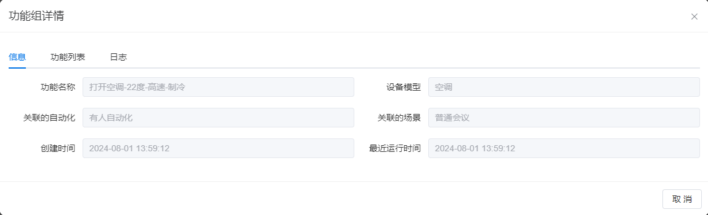

# 功能组
功能组的目的是为设备的一组相关功能预定义一组值，以便在满足特定条件时触发相关的自动化或场景。
## 添加功能组
### 功能组基本信息
#### 功能组名称
- 必填项，不可重复。
- 建议输入具有含义的文字，便于理解和记忆。
- 用户列表展示及其他模块使用。
### 功能列表
- 每个功能是必选的，至少包含一个功能。
- 您可以通过点击[继续添加]按钮来添加新的功能。
- 每个功能包含设备模型、设备功能以及参数。

请确认功能组中至少包含一个功能。

- 单个功能的表单

- 包含多个功能的表单

##### 设备模型
- 必填项，单选。
- 数据来源于物模型库。
##### 设备功能
- 必填项，单选。
- 数据根据所选的物模型自动填充。
#### 参数值
- 必填项。
- 参数列表的数量由所选择的功能决定。
- 当自动化或场景触发当前功能组时，空间内相应的设备将设置相应参数的当前值。
  - 设备属于当前功能组中选择的物模型。
  - 设备与当前功能组中设置的功能相关。

::: caution 警告 
功能参数：必须根据参数描述填写正确的参数值，设置非法值将影响最终的执行效果。 :::

#### 3. 标签
- 选填；多选。
- 以标签的形式对功能组进行分组，以便后续的控制效果。
- 当自动化或场景触发当前功能组时，空间内相应设备将设置对应的参数为当前值。
  - 设备属于当前功能组中选择的物模型。
  - 设备与当前功能组中设置的功能相关。
  - **设备拥有当前选择的标签**。
## 修改功能组
表单说明同[添加功能组](#添加功能组)
## 删除功能组
支持一键批量删除。

::: caution 警告 
已被使用的功能组无法直接删除。在删除之前，请确保先从对应的自动化和场景中移除使用。 
:::

## 查看功能组列表
可以按功能组名称进行分页展示。

## 查看功能组详情
### 信息
- 显示功能组的详细信息：
  - **功能组名称**：用户新增时输入。
  - **设备模型**：用户新增时选择。
  - **关联的自动化**：显示使用了该功能组的自动化列表。
  - **关联的场景**：显示使用了该功能组的场景列表。
  - **创建时间**：记录功能组创建的时间。
  - **最近运行时间**：显示功能组最后一次修改的时间。

 

### 功能列表
列出功能组中选择的模型及其对应的设备参数、设置的数值以及选择的标签。

### 日志
- 记录功能组变化时的日志信息，包括：

  - **日志级别**：指示日志的严重程度。

  - **日志内容**：描述功能组变化的具体内容

    - 新增功能组
    - 修改功能组
    - 删除功能组
    - 执行功能组
    
  - **日志时间**：记录日志的时间。

  - **详细信息**：提供关于功能组变化的详细描述及来源。

    

