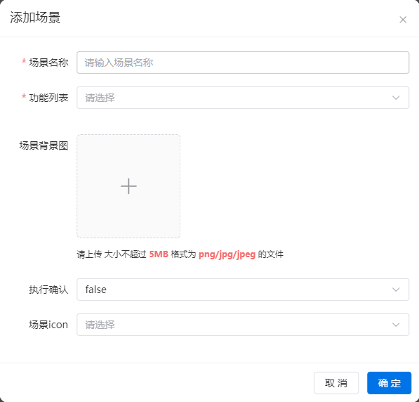
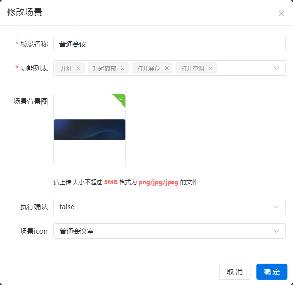
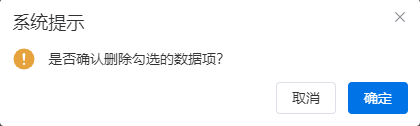
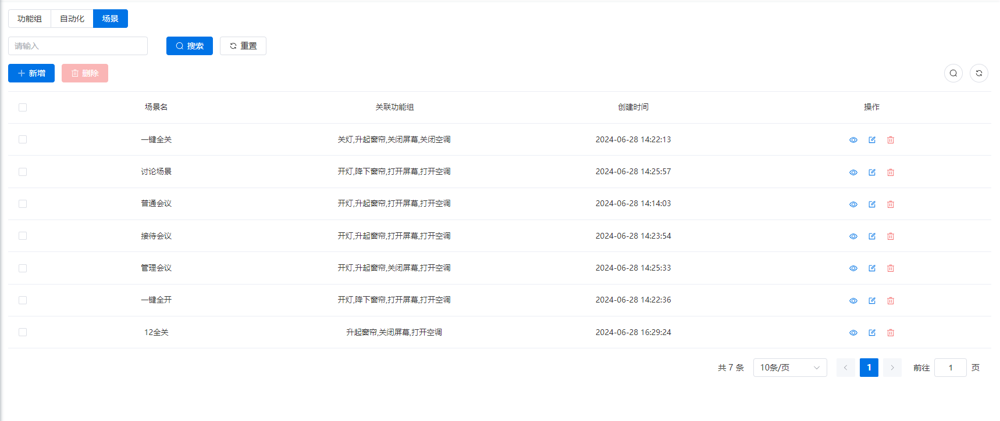
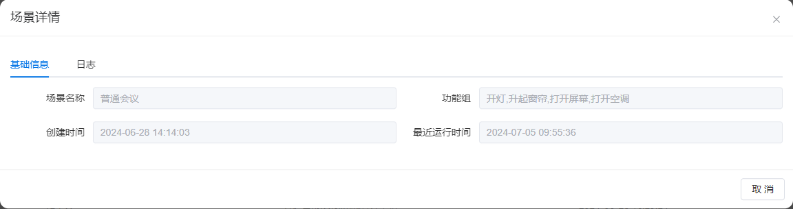
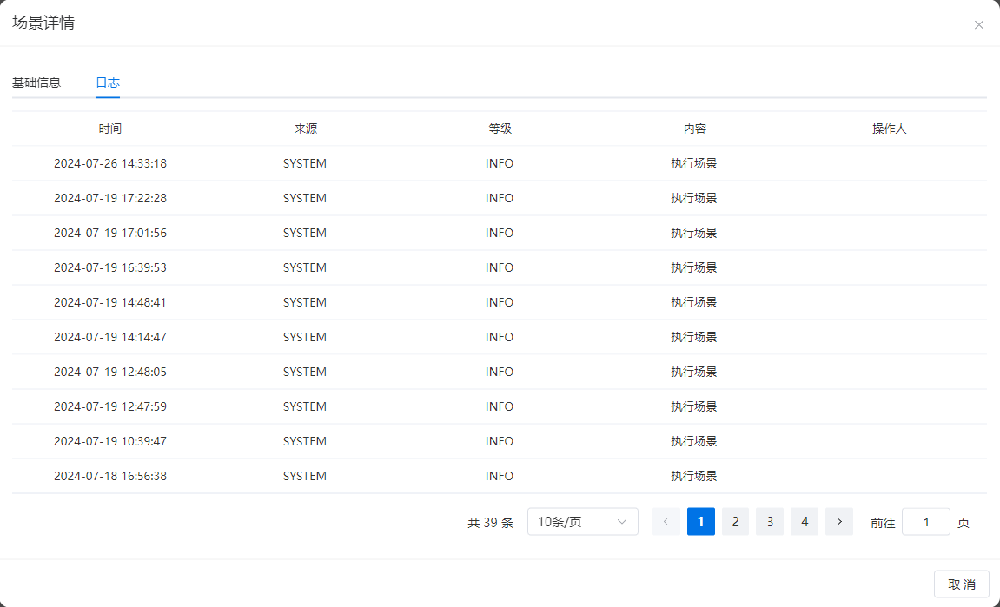

# 场景
​		场景通过物模型以及功能组，一键控制设备，实现客户定制的的场景，例如“开会”场景，控制灯光、温度、设备等，提供智能且定制化的环境控制。
## 添加场景

 

### 1. 场景名称
- 必填项；不可重复。
- 场景名称应为有意义的字符序列，便于理解和记忆，用于其他模块的选择和展示。
### 2. 功能组列表
- 必填项；可多选。
- 从功能组列表中选择当前场景所需的功能组。
### 3. 场景背景图
- 非必填项。
- 文件大小需小于5MB。
- 文件格式应为PNG、JPG或JPEG。
### 4. 执行确认
- 非必填项。
- 选择是（false）或否（true），默认为否。
- 用于对场景执行进行二次确认。
### 5. 场景icon
- 非必填项。
- 内置选项包括：普通会议icon、讨论会议icon、面试会议icon、管理会议icon、一键全开icon、一键全关icon。
- 默认为管理会议icon。
## 修改场景
- 参数类似于新增场景。

  
  
  
  
  

## 删除场景
- 场景需经确认后方可删除。

- 与其他实体关联的场景不可删除，需先解除关联才可删除。

  

## 查询场景列表
可根据场景名称进行查询，并进行分页展示。
- **场景名**：用于理解和记忆当前场景的有意义文字描述。
- **关联功能组**：维护场景时选择的功能组列表；在仪表盘的场景列表中点击场景可将空间下绑定的设备参数一键切换为功能组中的设置值。
- **创建时间**：场景创建的时间。
- **更新时间**：场景最后更新的时间。
- **操作**：单个场景可执行的操作列表，包括查看详情、修改、删除。

## 场景详情
列表中仅展示场景的名称和关联功能组，其他详细信息可从场景详情中查询。
### 1. 基础信息

### 2.场景日志
记录场景变化时的日志信息，包括日志级别、日志内容、日志时间以及详细信息。
	
日志内容包括：
    1.添加场景
    2.修改场景
    3.删除场景
    4.执行场景

