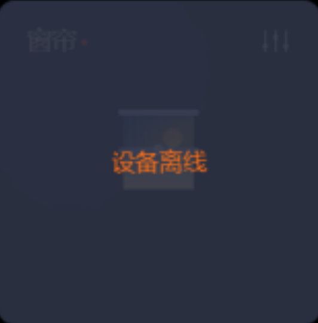
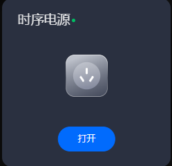

# 仪表盘
## 面板和仪表盘的区别
### 面板
在此处，面板指的是中控面板，是一种物理设备，用于触摸操作

### 仪表盘
仪表盘指的是信息可视化界面，用于展示平台中配置的设备、设备组列表和场景列表，方便实时控制和监控。

换言之，仪表盘是中控面板上可操作的界面。

## 仪表盘布局
下图为未绑定空间时仪表盘的布局

下图为已绑定空间的仪表盘布局

## 布局分区域说明
分为状态区（1红框）、控制区（2蓝框）、提示区（3绿框）

- ### 状态区

  - ①logo

    - 

  - ②空间标识

    - 展示空间标识、绑定的空间名称。

  - 时间

  - 传感器设备

    - #### 人体传感器

      人体传感器可以展示设备的三种状态：离线、有人和无人。上图展示了设备离线状态。

      &nbsp;&nbsp;&nbsp;&nbsp;	 传感器有人；

      &nbsp;&nbsp;&nbsp;&nbsp;  人体传感器离线或无人，具体可通过文字区分；

    - ####  空气传感器

      ​		通过直观的界面展示空气传感器的在线和离线状态，同时清晰呈现PM2.5、温度和湿度三个属性的具体数值。通过巧妙的颜色区分，使用户能够直观地辨别数值的高低，进而更清楚地了解空气质量和环境数据。

      颜色划分如下：

      &nbsp;&nbsp;&nbsp;&nbsp;  空气传感器离线

      ##### **PM2.5**

      &nbsp;&nbsp;&nbsp;&nbsp;  PM2.5 < 50ug ;

      &nbsp;&nbsp;&nbsp;&nbsp;  50ug <  PM2.5 < 100ug 

      &nbsp;&nbsp;&nbsp;&nbsp;  PM2.5 > 100ug ;
      
      ##### **温度**
      
        &nbsp;&nbsp;&nbsp;&nbsp;  15 <= 温度 < 26 ;
      
        &nbsp;&nbsp;&nbsp;&nbsp;   温度 < 15
      
        &nbsp;&nbsp;&nbsp;&nbsp;   温度 >= 26

##### 									 **湿度**

​					    &nbsp;&nbsp;&nbsp;&nbsp;  44 <= 湿度 < 75 ;

​						&nbsp;&nbsp;&nbsp;&nbsp;   湿度 < 45;

​						&nbsp;&nbsp;&nbsp;&nbsp;   湿度 >= 75

##### 					示例

  

  - 人体传感器
    - 设备在线
    - 感应有人
  - 空气传感器
    - 设备在线
    - PM2.5=72.0ug，正常
    - 温度=27.9，偏高
    - 湿度=24.0%RH ,偏低

  - 关闭按钮

    - 提供一键控制关闭所有设备的功能。

  - 高级控制

    - 进入高级控制模式，可调试各个设备。

- ### 控制区

  - 主控
    - 按照空间配置中选定的设备顺序展示设备。
    - 如果选定的设备中包含灯、空调、窗帘等模块，则优先显示灯、空调、窗帘模块；如果没有选定这些模块，则按照选定的顺序展示设备。

  - 场景

    

- ### 提示区

### 6.设备卡片
可展示空间中的设备列表，如灯光、屏幕、空调、窗帘。

### 7.设备组卡片
展示空间中的设备组列表。卡片上有两个图标。

### 8. 注意事项
仪表盘最下侧展示的文字为面板配置的注意事项。

### 10. 版本

展示当前版本信息。

## 场景控制

- 如果空间中绑定了场景，按照场景选择的先后顺序排列展示。

- 在场景配置中，还设置了是否需要二次确认执行。

## 四寸方屏

四寸方屏控制常见设备，如灯光、空调、窗帘和屏幕，适合广泛的安装位置。

    
    

## 监控详情

监控卡片展示设备和设备组的名称、状态、属性以及操作按钮；
### 灯光设备
#### 设备

    

        
下图为设备离线的效果

        
    

    

        
下图为设备在线的效果

        
    

##### 设备操作
###### 开灯
当灯光关闭时，[灯泡]图标显示为灰色。点击【打开】按钮将点亮灯泡，使其变亮。

###### 关灯

同理，当灯光打开时，[灯泡]图标显示为亮色。点击【关闭】按钮将关闭灯光，使灯泡图标恢复为灰色。

    

        
下图为开灯后的效果

        
    

    

        
下图为关灯后的效果

        
    

###### 调节亮度

第一种：

​		当灯光开启时，在卡片的自定义操作按钮，点击后弹出操作框。可拖拽进度条调整灯光的亮度，当亮度为0时即为关闭灯光；

第二种：	

​		当灯光开启时，在卡片的右上角有操作按钮（需要进入高级控制里面），点击后弹出操作框。可拖拽进度条调整灯光的亮度，当亮度为0时即为关闭灯光；

    

        
第一种的效果

        
    

    

        
第二种的效果

        
    

#### 设备组

    

        
下图为设备组灯在线的效果

        
    

    

        
下图为设备组灯离线的效果

        
    

#### 设备组操作
除同步操作外，其他与[灯光设备](#灯光设备)相同,操作后，组内的所有设备将同时调整。
### 空调设备
#### 设备

    

        
下图为空调离线的效果

        
    

    

        
下图为空调在线的效果

        
    

##### 设备操作

###### 开启关闭空调

第一种：

​		当空调关闭时，[空调]图标为灰色，点击【打开】的按钮，即为打开空调。

​		同理，当空调打开时，点击【关闭】的图标，即为关闭空调，[空调]的图标变为灰色。

    

        
下图为空调打开的效果

        
    

    

        
下图为空调关闭的效果

        
    

第二种：

​		在主屏幕上，当空调关闭时，[空调]图标显示为灰色。点击【打开】按钮将打开空调，并显示当前空调的温度、风速以及模式设置。

​		同理，当空调打开时，点击右上角【关闭】的按钮，即为关闭空调，[空调]的图标变为灰色。

    

        
下图为空调打开的效果

        
    

    

        
下图为空调关闭的效果

        
    

###### 调节空调
当灯空调开启时，在卡片的右上角有操作按钮，点击后弹出操作框。
空调模型可以调整温度、风速以及模式这三个参数，如下图所示：

- **模式**
    - 空调的模式包括冷风、热风和送风三种，当前选中的模式会以高亮显示。
- **温度**
    - 显示当前空调设定的温度，进度条的位置表示当前设定的温度值。
- **风速**
    - 空调的风速可以设置为高速、中速、低速或自动四种选项，当前选中的风速会以高亮显示。

​	调整空调参数后，外部设备卡片将实时更新显示。

#### 设备组在线和离线

    

        
下图为空调组在线的效果

        
    

    

        
下图为空调组离线的效果

        
    

#### 设备组状态

    

        
下图为空调组关闭的效果

        
    

    

        
下图为空调组打开的效果

        
    

##### 设备组操作
除同步操作外，其他与空调操作相同，操作后，组内所有设备的参数将同步变化。

### 窗帘设备
#### 设备

    

        
下图为窗帘在线的效果

        
    

    

        
下图为窗帘离线的效果

        
    

##### 开启关闭设备

窗帘开启即为窗帘下来，位置为100时说明窗帘完全下来，位置为0时说明窗帘关闭即为窗帘完全开启；
如下图窗帘开启，窗帘开启，位置100，在真实空间内，窗帘是完全拉下来的

又如下图窗帘关闭，窗帘关闭，位置0，在真实空间内，窗帘是完全拉开的。

    

        
窗帘开启

        
    

    

        
窗帘关闭

        
    

##### 设备操作
可操作窗帘的位置，外部的窗帘卡片实时更新位置，当位置为0时卡片图标置灰。

    

        
主屏操作

        
    

    

        
高级控制操作

        
    

#### 设备组

    

        
窗帘组离线的效果

        
    

    

        
窗帘组在线的效果

        
    

##### 设备组操作

    

        
主屏操作

        
    

    

        
高级控制操作

        
    

### 屏幕设备

#### 设备状态

    

        
屏幕在线

        
    

    

        
屏幕离线

        
    

#### 设备操作

    

        
屏幕打开

        
    

    

        
屏幕关闭

        
    

#### 设备开启关闭
点击【打开】按钮开启关闭设备
### 设备组
#### 设备组状态

    

        
屏幕组在线的效果

        
    

    

        
屏幕组离线的效果

        
    

#### 设备组操作

    

        
屏幕组关闭的效果

        
    

    

        
屏幕组打开的效果

        
    

### 音频设备

#### 设备
##### 设备状态

    

        
音频在线的效果

        
    

    

        
音频离线的效果

        
    

##### 设备操作

    

        
音频静音的效果

        
    

    

        
取消静音的效果

        
    

##### 开启关闭设备
点击音频右上角的按钮可调节音频的音量大小。调节音量数值越大，音量越大。

### 音频处理器

##### 设备状态

    

        
音频处理器离线的效果

        
    

    

        
音频处理器在线的效果

        
    

##### 设备操作

### 视频矩阵
##### 设备状态

    

        
视频矩阵离线的效果

        
    

    

        
视频矩阵在线的效果

        
    

#####  设备操作

### 摄像头设备
#### 设备
##### 设备状态

    

        
摄像头离线的效果

        
    

    

        
摄像头在线的效果

        
    

##### 设备操作

### 时序电源

##### 设备状态

    

        
时序电源离线的效果

        
    

    

        
时序电源在线的效果

        
    

##### 设备操作

    

        
时序电源关闭的效果

        
    

    

        
时序电源打开的效果

        
    

### 时序电源设备组
##### 设备组状态

    

        
时序电源组在线的效果

        
    

    

        
时序电源组离线的效果

        
    

##### 设备组操作

    

        
时序电源组打开的效果

        
    

    

        
时序电源关闭的效果

        
    

