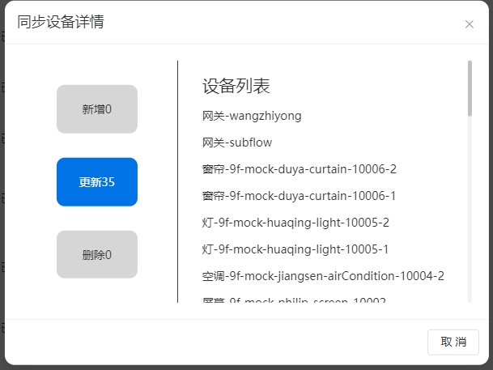
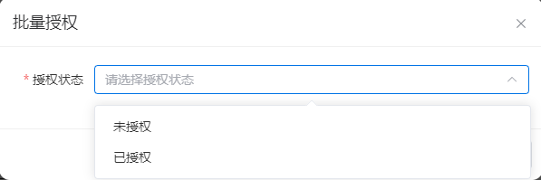
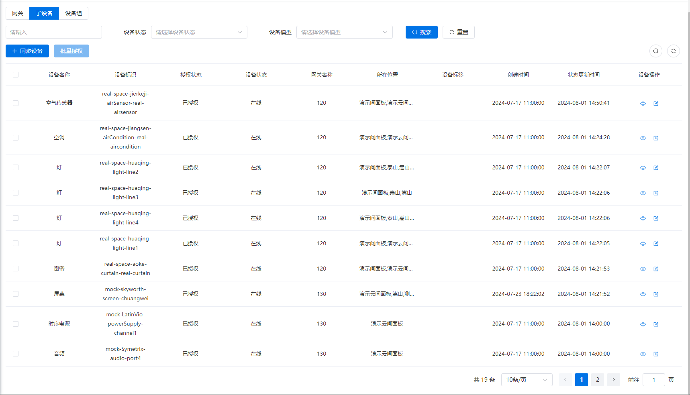
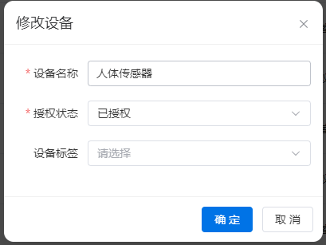
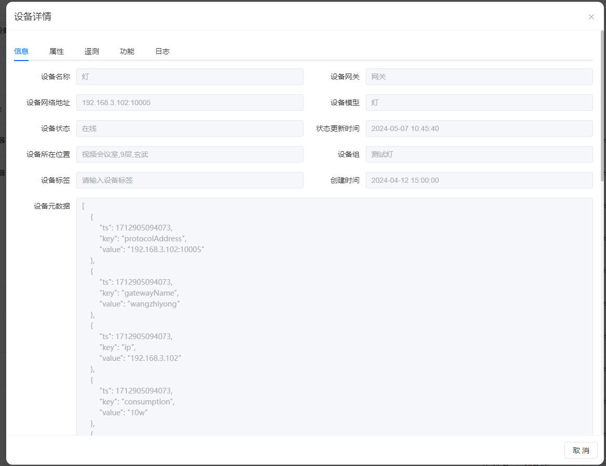
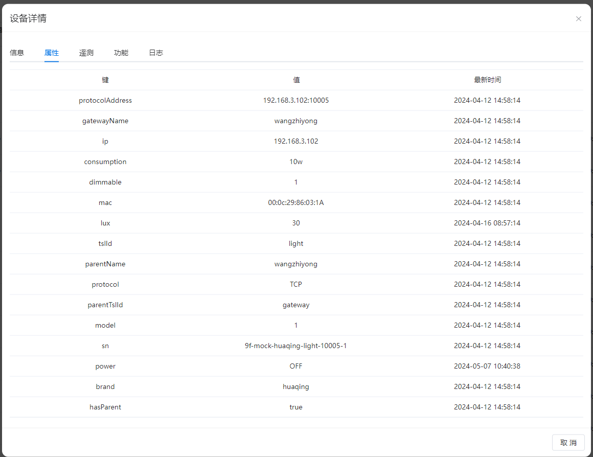
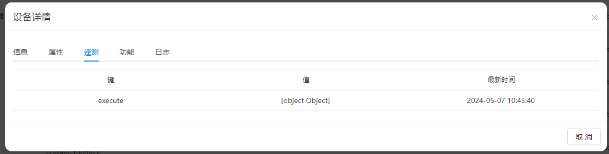
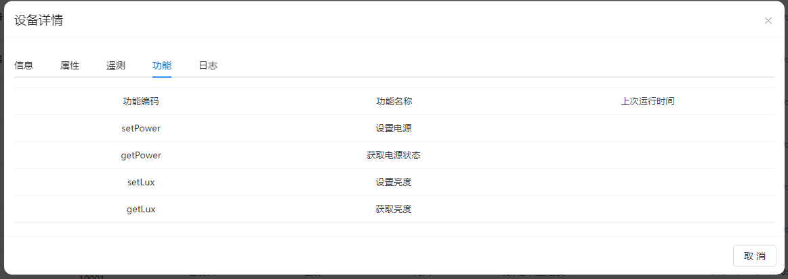
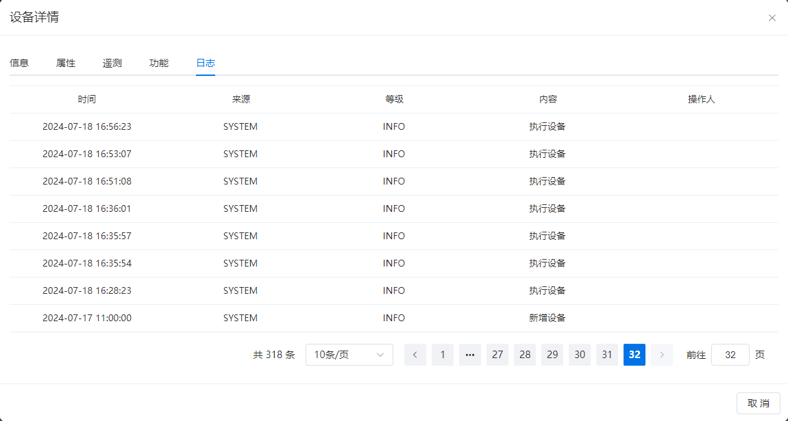

# 子设备
​		指连接到网关并在特定空间内使用的设备，每个子设备都绑定了对应的物模型。系统通过配置这些物模型来实现设备的控制功能。

## 同步设备
将网关中绑定的设备同步到系统中：

**新增：** 设备列表显示新增的设备。

**更新：** 设备列表显示更新的设备。

**删除：** 设备列表显示删除的设备。

## 批量设备授权

新增设备需授权后方可在系统中使用。

## 设备列表
​		设备列表包含了当前系统中所有设备的详细信息和状态更新，通过设备列表，用户可以快速了解系统中各个设备的情况，监控设备的状态变化，并进行必要的操作和管理。

- 设备列表说明如下：
  - **设备名称：** 设备在系统中的显示名称，用于在设备列表和相关功能中展示。
  - **设备标识：** 设备的唯一标识，用于设备间的通信和识别。
  - **授权状态：** 表示设备是否已被授权使用的状态。
  - **设备状态：** 设备当前是否在线的状态指示。
  - **网关名称：** 设备连接的网关的名称，确保网关在网关管理中存在。
  - **所在位置：** 设备当前安装或部署的位置，可以在对应位置的仪表盘中进行操作。
  - **设备标签：** 设备的分类标签，用于方便管理和控制设备，例如前排灯、后排灯等，标签数据由标签管理维护。
  - **创建时间：** 设备创建的时间。
  - **状态更新时间：** 设备状态最近一次更新的时间。
## 修改设备

查看设备详情时，您可以进行以下操作：

- 修改设备名称。

- 调整设备的授权状态。

- 选择性地为设备添加标签（可以多选），以便更好地分类和管理。

  

## 查看设备详情
可以查看特定网关的详细信息，包括以下内容：
- **基本信息**
  - 在此处，可以查看设备的基本信息如下：
  
    - **设备名称：** 可进行修改。
  
    - **设备网关：** 设备所绑定的网关设备。
  
    - **设备网络地址：** 设备的IP地址及端口信息。
  
    - **设备模型：** 设备的物理模型，例如灯、空调、电视等。
  
    - **设备状态：** 显示设备的在线或离线状态。
  
    - **状态更新时间：** 显示设备状态的最近更新时间。
  
    - **设备所在位置：** 设备当前绑定的位置，可以在该位置的仪表盘中进行设备控制。
  
    - **设备标签：** 设备关联的标签，在编辑设备时可以添加和管理。
  
    - **创建时间：** 设备的创建日期。
  
      

### 属性
展示设备中的所有属性信息时，不同类型和型号的设备可能具有不同的属性。例如下图为一个灯光设备的属性。

### 遥测
展示通过设备上报的最新的遥测数据。

### 功能
设备支持的功能，例如下图为一个灯光设备的功能列表。

### 日志
设备日志记录设备状态变更的信息，包括以下内容：

- **日志级别：** 记录日志的严重程度，如信息、警告、错误等。
- **日志内容：** 描述日志所记录的事件，包括以下类型：
  1. 新增设备
  2. 修改设备
  3. 删除设备
  4. 设备上线
  5. 设备下线
  6. 设备执行（如指令执行情况）
- **日志时间：** 记录日志事件发生的时间。
- **详细信息：** 提供关于事件的详细信息，例如设备的具体操作或状态变化。

