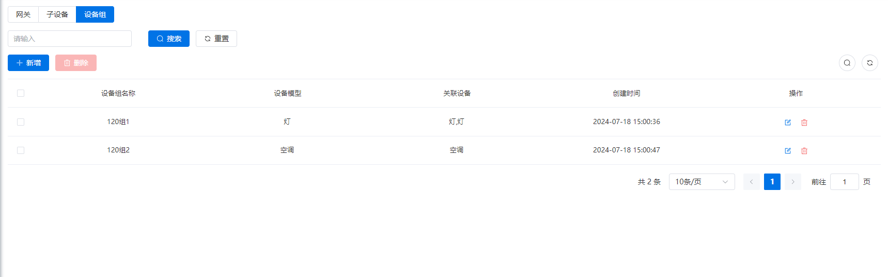
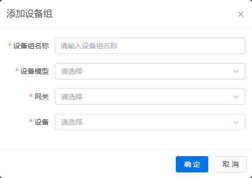
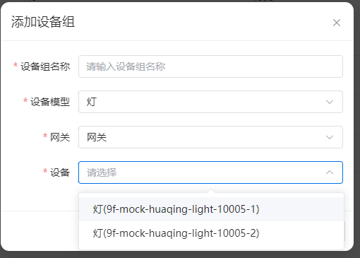
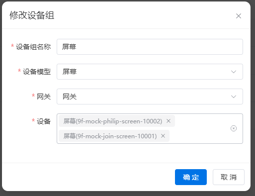

# 设备组
​		指在同一网关下按照相同物理模型或功能特性进行分组管理的设备集合。设备组主要用于逻辑上的组织和管理，以便更高效地进行设备操作和监控。

设备组的优势在于：

- **统一管理：** 将功能相似或相关的设备集中管理，便于批量操作和监控。
- **简化操作：** 可以快速查看和控制特定类型设备的状态和设置。
- **优化体验：** 提升用户体验，使设备的使用和管理更加直观和高效。

#### 分页查询
可根据设备组的名称搜索。

## 添加设备组

- #### 设备组名称

  设备组名称应具备以下特性：

  - **必填项：** 用户在创建设备组时必须填写。

  - **租户内唯一：** 在同一租户内不可重复，确保设备组的唯一性。

  - **列表展示：** 设备组名称将用于在列表中展示，以便用户快速识别和选择。

    

- #### 设备模型

  设备模型选择需考虑以下要素：

  - **必填项：** 在创建设备组时，用户需从预定义的物模型库中选择一个适用的设备模型。
  - **单选项：** 用户只能选择一个设备模型作为设备组的模板。
  - **数据来源：** 物模型库中的数据，确保准确性、完整性和易用性，方便用户选择和应用。

  设备模型的选择能够帮助用户快速设定设备组的功能和属性，使设备管理和监控更加高效和一致。

  

- #### 网关
  网关选择功能需要以下设定：
  - **必填项：** 在创建设备组时，用户必须从可用网关列表中选择一个适用的网关。
  
  - **单选项：** 每个设备组只能关联一个网关，用于设备通信和管理。
  
  - **数据来源：**[网关](gateway.md) 选择列表数据来源应确保准确性和完整性，便于用户正确选择。
  
    
  
- #### 设备

  - **必填项：** 用户必须至少选择一个设备来添加到设备组中。
  - **多选项：** 用户可以从下拉框中选择一个或多个设备。
  - **数据展示：** 下拉框中应展示设备的名称和标识，以便用户明确选择。
  - **数据来源：**  [子设备](device.md)

- 下拉框展示设备名称以及设备标识

## 修改设备组

表单说明：同[添加设备组](#添加设备组)

数据要求：
1. **设备物模型一致性：** 用户所选设备必须属于同一种物模型。物模型定义了设备的功能和属性，保证了设备在操作和管理时的一致性和可预测性。
2. **网关一致性：** 在更新操作之前和之后，所选设备必须连接在同一个网关下。网关是设备通信的桥梁，确保设备能够有效地与系统进行交互和管理。

这些数据要求不仅保证了设备操作的稳定性和可靠性，同时也简化了系统管理和维护的复杂性。通过确保设备物模型和网关的一致性，系统能够有效地处理和响应用户的操作请求

## 删除设备组
支持单个删除和批量删除操作。 

::: caution 警告 如果设备组被其他实体关联，例如被空间关联，则无法删除该设备组。 :::
