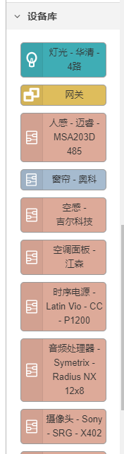

# 网关

## 添加网关

- ### 网关名称

  - **必填项**，在租户内必须唯一。

  ### 设备序列号

  - **必填项**，在租户内必须唯一。

  ### 网关秘钥

  - **必填项**，在租户内必须唯一。

  ### 授权状态

  - **必填项**，租户可选择已授权或未授权状态。
## 修改网关
只能修改网关名称和授权状态，设备序列号和网关秘钥不可更改。

## 配置网关
通过可视化配置界面，配置网关下设备列表、通信方式、工作流程等功能。

### 模块界面
可视化配置界面的左侧为模块列表，分为以下几种类型
#### 通用
一些公共的节点，用于协助调试，捕获异常，或某个特殊时间点触发

- inject : 手动或定期得将消息注入流中。消息的有效荷载可以为多种类型，包括字符串，JavaScript对象或当前时间。
- debug : 在“调试”侧边栏选项卡和运行时日志中显示选定的消息属性。 默认情况下，它会显示msg.payload的值，但您也可以将其设置成显示任意属性，完整消息或JSONata表达式的结果。
- complete: 当另一个节点完成对消息的处理时触发流。
- catch: 捕获由同一标签页上的节点引发的错误。
- status: 获取在同一标签页上的其他节点的状态消息。
- link in : 在流之间创建虚拟连线（输入端）。
- link call : 
- link out : 在流之间创建虚拟连线（输出端）。
- comment : 可用于向流添加注释的节点。

#### 功能
这里的节点都是处理消息体，逻辑分流，设置模板，延迟，执行

- function: 定义对接收到的消息进行处理的JavaScript代码（函数的主体）。
- switch: 按属性值来分配消息的传送路线。
- change: 设置，更改，删除或移动消息，流上下文或全局上下文的属性。
- range: 将数值映射为另一个区间的数值
- template: 根据提供的模板设置属性。
- delay: 对通过节点的消息进行延迟发送或限制。
- trigger: 触发后，将会发送一条消息。如果被拓展或重置，则可以选择发送第二条消息。
- exec: 运行系统命令并返回其输出。
- filter: 按异常报告（RBE）节点-仅在有效负载发生更改时传递数据。它也可以阻止，除非，或者如果值更改了指定的量则忽略（死区和窄带模式）。
- low-case: 当前节点主要功能是实现将message的payloads转换为小写字符，并传入一下节点。
#### 网络
网络节点是实现了各种协议的通讯协议，mqtt，http，websocket，tcp，udp

- mqtt in : 连接到MQTT代理并订阅来自指定主题的消息。
- mqtt out : 连接到MQTT代理并发布消息。
- http in : 创建用于创建Web服务的HTTP端点。
- http response: 发送HTTP请求并返回响应。
- websocket in : WebSocket输入节点。
- websocket out : WebSocket输出节点。
- tcp in : 提供TCP输入选择。可以连接到远程TCP端口，或接受传入连接。
- tcp out : 提供TCP输出的选择。可以连接到远程TCP端口，接受传入的连接，或回复从TCP In节点收到的消息。
- tco request : 一个简单的TCP请求节点。将msg.payload发送到服务器tcp端口，并期望得到响应。
- udp in : UDP输入节点。在msg.payload中生成Buffer，字符串或Base64编码的字符串。支持组播。
- udp out : 该节点将msg.payload发送到指定的UDP主机和端口。支持组播。
- telnet - read : 从telnet客户端连接提供输出的节点
- telnet - send : 通过双向电话客户端连接发送数据的节点。
- telnet - request ：从telnet客户端连接提供输出的节点
- telnet - echo : 从telnet客户端连接提供输出的节点
- serial in : 从本地串行端口读取数据。
- serial request : 提供到请求/响应串行端口的连接。
- ping : Ping一台机器，并将行程时间以mS为单位返回为msg.payload。

#### 序列化
对消息体进行分割，组合，排序，或创建的一些实现

- split : 将一条消息拆分为一系列消息。
- join: 将消息序列合并为一条消息.
- sort : 对消息属性或消息序列进行排序的函数。
- batch: 根据各种规则创建消息序列。
#### 解析
这些节点用于实现将csv，html，json，xml，yaml解析成想要的数据格式

- csv: 在CSV格式的字符串及其JavaScript对象表示形式之间进行相互转换。
- html: 使用CSS选择器从msg.payload中保存的html文档中提取元素。
- json: 在JSON字符串及其JavaScript对象表示形式之间相互转换。
- xml: 在XML字符串及其JavaScript对象表示形式之间进行相互转换。
- yaml: 在YAML格式的字符串及其JavaScript对象表示形式之间相互转换。

#### 存储
对文件的几种操作，写入，读取文件，监听一个文件目录，或者添加要监视的内容到配置的文件中

- 写入文件：将msg.payload写入文件，添加到末尾或替换现有内容。或者，它也可以删除文件。
- 读取文件：以字符串或二进制缓冲区的形式读取文件的内容。
- watch: 监视目录或文件中的更改。

#### BACnet
用户BACnet协议的读写以及提交方法

- BACnet - Read
- BACnet - Write
- BACnet - Command
#### modbus
提供modbus串行通信协议的使用方法。节点提供一个基于节点Modbus（jsmodbus）的Modbus TCP服务器进行测试。

- Modbus - Response : 节点显示状态下Modbus读/写/取节点第二次输出的响应或响应长度。
- Modbus - Read : 读取节点信息，如果您在一个通信配置上有10个以上的节点，请使用Modbus Flex Getter或考虑到您的Modbus设备的多个连接！您也可以通过使用具有间隔的注入节点，使用Modbus Getter和Modbus Flex Getter进行轮询。
- Modbus - Getter: 读取节点
- Modbus - Flex - Fetter : 灵活输入触发具有连接输入参数的读取节点。
- Modbus - Writer: 写入节点。如果您在一个通信配置上有10个以上的节点，请使用Modbus Flex Writer或考虑到您的Modbus设备的多个连接！
- Modbus - Flex - Write ： 灵活的输入触发了具有连接输入参数的写入节点。
- Modbus - Server : 节点提供一个基于节点Modbus（jsmodbus）的Modbus TCP服务器进行测试。
- Modbus - Flex - Server: 节点提供一个灵活的基于Modbus串行的Modbus TCP服务器进行测试。
- Modbus - Queue - Info : 每个单元设置一个队列-设置单元id以获得正确的信息。
- Modubs - Flex - Connector : 一个用于灵活输入触发器的节点，用于重新连接新的连接参数。
- Modbus - Requese - Filter : 响应过滤器
- Modbus - Flex - Sequencer : TCP/串行灵活输入触发具有连接输入参数的自动序列读取节点。
#### BA SIC

- recv_rpc
- report
#### 设备库
现有支持的设备列表，已支持以下设备。

### 详细说明界面
#### 信息
可视化配置界面的右侧流程详细内容、选择节点的属性信息。

#### 调试窗口
打印节点的日志，便于调试和排错

#### 帮助
查看节点的帮助文档，便于配置流程

#### 配置节点
查看流程中的所有配置

#### 上下文
查看节点的上下文信息

### 流程配置界面
main中展示该网关配置下所有的设备列表。通过设置设备的属性来连接网关与设备。

可通过拖拽左侧的模块到中间画布部分，双击画布中的模块，可编辑模块的内容。不同的模型类型，可编辑的属性不同。
以下为网关设备的编辑属性：

以下为窗帘-奥科的编辑属性

### 部署
修改画布中的内容后，必须点击右上角的【部署】按钮才会生效。
### 使用示例
#### 示例1：读取串口数据并输出到调试窗口

1. 从左侧【网络】中将【serial in】拖拽到画布，双击编辑属性，输入串口端口【Serial Port】

2. 从左侧【功能】中将【function】拖拽到画布，function是定义对接收到的消息进行处理的JavaScript代码（函数的主体），双击编辑设置以及运行函数

3. 从左侧【通用】中将【debug】拖拽到画布，debug是在“调试”侧边栏选项卡和运行时日志中显示选定的消息属性。 默认情况下，它会显示msg.payload的值，但您也可以将其设置成显示任意属性，完整消息或JSONata表达式的结果。

双击编辑输出内容以及目标

以上三步完成后，画布如下图展示

以上实现：当从串口中读取到消息后，将执行【function】中的运行函数并返回消息内容，输出到调试栏中。
## 网关列表
分页展示网关列表信息，可通过网关名称查询。

### 列表说明
- 网关名称：即新增时输入的网关名称。
- 网关状态：网关新增后系统对接网关设备后，检测的状态，包括：初始化、离线、在线。
- 授权状态：即新增时选择的授权。
- 许可证：默认许可证为空，在后台配置中上传后显示许可证信息。
- 网关地址：即新增时输入的设备序列号。
- 子设备数量：网关中连接的设备数量。
- 创建时间：网关新增时间。
- 状态更新时间：网关最新更新时间。
## 网关详情
可查看某个网关的详细信息，包括基本信息、属性、遥测数据、功能以及日志。
### 基本信息
展示网关的基本信息、位置以及元数据

### 属性
展示通过网关上报的最新的属性信息

### 遥测
展示通过网关上报的最新的遥测数据。

### 功能
网关支持的功能，例如下图，此网关有重启功能。

### 日志
记录网关变化时日志信息，包括：日志级别、日志内容、日志时间以及详细信息。

日志内容包括：
1. 新增网关
2. 修改网关
3. 设备上线
4. 设备下线
5. 上报许可证
