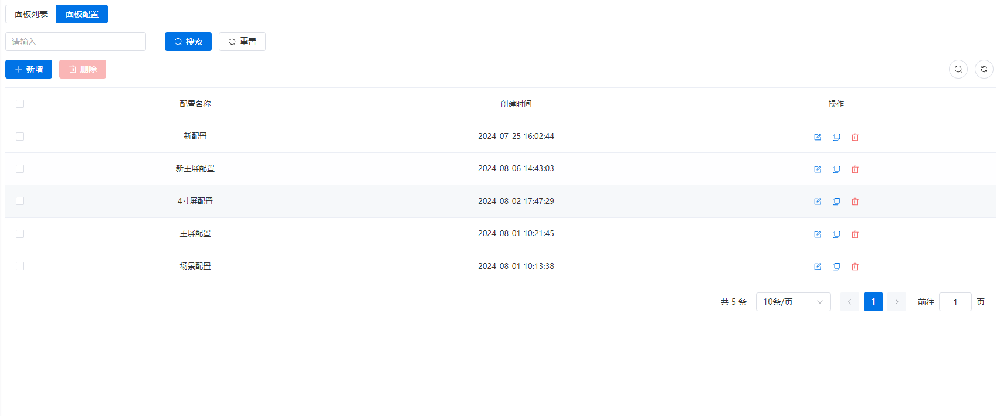

# 面板配置
## 配置列表
配置列表包括配置名称、创建时间和操作。

## 新增配置

### 配置名称

  - **必填字段**；不可重复。
### 注意事项
  - **选填字段**。
  - 将会显示在仪表盘正下方。
### 空间标识图片
  - **选填字段**；如果未提供，默认不显示。
  - 仅支持 png、jpg、jpeg 格式。
  - 文件大小不超过 5 MB。
#### 背景图
  - 选填；没有时展示默认背景图。
  - 将平铺在仪表盘。
  - 仅支持png、jpg、jpeg。
  - 大小不超过5M。
#### 场景背景图
  - 选填；没有时展示默认背景图。
  - 将平铺在场景。
  - 仅支持png、jpg、jpeg。
  - 大小不超过5M。
#### 屏保类型
  - **必填项。**
  - 屏保的目的是防止面板出现烧屏现象。
  - 可选择动图或抖动。如果选择动图，需设置屏保响应时间；选择抖动，则客户无感知。
#### 默认页面
  - 场景控制。
  - 高级控制。
  - 4寸方屏。
#### 场景间隔时间
  - 间隔的时间单位为秒（S）。
  - #仪表盘中点击场景后，间隔多久可以再次点击。
#### 屏保响应时间
  - 用户多久没有操作后，将出现屏保动图。

  - 当屏保类型为动图时，该配置生效。

#### 场景间隔范围

  - 单场景；单个场景显示漏斗状态。
  - 全场景；全部场景显示漏斗状态。
#### 展示区域配置
- 状态区。
- 提示区。

#### 支持URL配置
- 开启。
- 关闭。
## 修改配置
同[新增配置](#新增配置)，修改后，绑定当前配置的面板的仪表盘将实时刷新
## 复制面板配置
除配置名称修改，其他与[新增配置](#新增配置)相同。修改后，绑定了这些配置的面板的仪表盘将实时刷新。

## 删除配置
- 可批量删除
- 正在使用的配置无法删除。