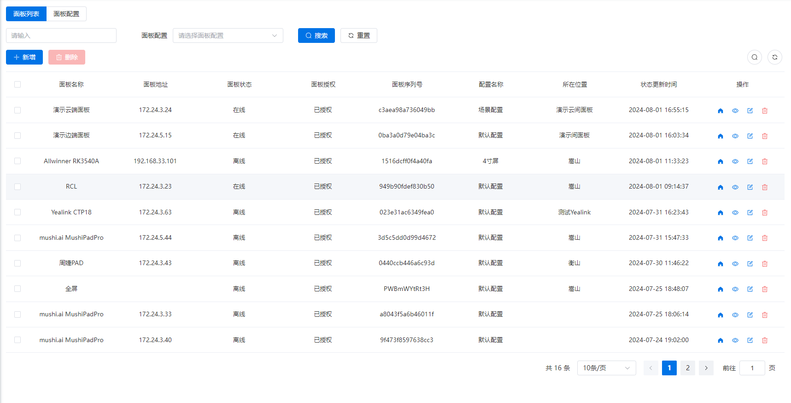
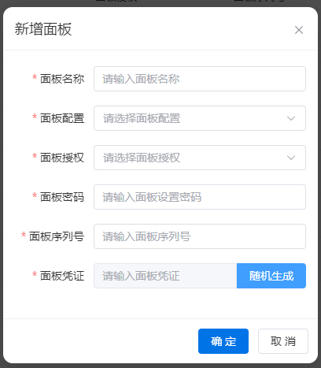
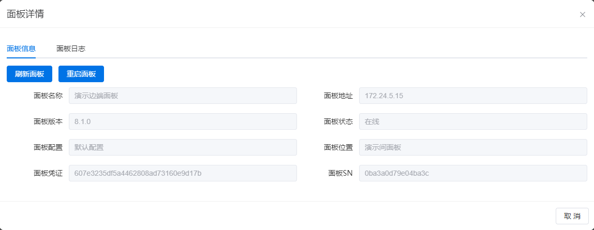
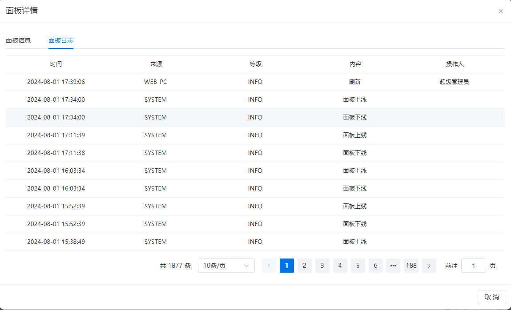
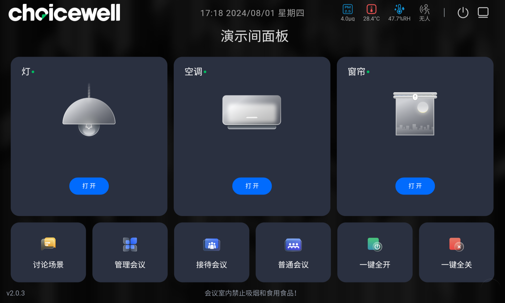
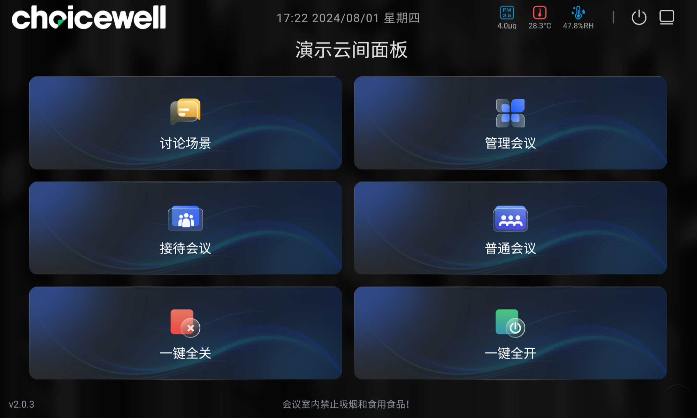

# 面板列表

对中控面板管理、维护以及配置。

## 面板和仪表盘的区别
详情查看[面板和仪表盘的区别](../dashboard.md)

## 面板搜索
- 可以根据以下信息搜索并分页展示面板：
  - **面板名称**：建议使用有意义的文字，便于理解和记忆，用于用户空间管理。
  - **面板地址**：面板的IP地址。
  - **面板状态**：在线或离线。
  - **面板授权**：已授权或未授权。
  - **面板序列号**：面板的唯一标识。
  - **配置名称**：当前面板使用的配置名称，面板内的仪表盘按此配置展示。
  - **所在位置**：面板绑定的空间，每个面板只能存在于一个空间中。
  - **状态更新时间**：面板的最后更新时间。

## 添加面板
​		可以通过Web端手动添加面板，也可以直接将面板连接到平台。如果平台中不存在该序列号的面板数据，则会自动创建一个新的面板记录。
### 手动添加面板
- #### 面板名称

  - **必填**。
  - 建议使用具有意义的文字，便于理解和记忆。

  #### 面板配置

  - **必选**。
  - 数据来源于面板配置。

  #### 面板授权

  - **必选**。
  - 可选项：已授权、未授权。
  - 用于空间使用。

  #### 面板密码

  - **必填**。
  - 四位数字。
  - 用于退出仪表盘。

  #### 面板序列号

  - **必填**；唯一。
  - 在手动添加时，必须确保与中控面板中的SN一致，否则无法使用。

  #### 面板凭证

  - **必填**；唯一。
  - 随机生成的字符串。
  - 用于仪表盘和系统的通信认证。

### 自动添加
- 当面板首次打开仪表盘并连接智能控制系统时，若系统中找不到对应的面板数据，系统将自动生成并保存一个面板数据到数据库中。
  - **面板名称：** 建议使用面板的品牌和型号，例如 "品牌X 型号Y"。

## 修改面板
除了不可修改面板序列号外，其他字段与[手动添加仪表盘](#手动添加)一致
## 删除面板
- 支持批量删除面板。
  - 无法删除正在使用的面板。
## 查看详情
### 面板详情
展示面板的详细信息

刷新面板：重新加载面板的界面或数据，以确保显示最新信息。

重启面板：完全关闭并重新启动面板设备，以重新初始化其所有功能和设置。

### 日志
记录面板的新增、修改、删除、上线、下线行为。

## 操控面板
从浏览器端可以直接打开面板中的仪表盘，对面板所属空间的设备进行监控和控制。
- 浏览器端中打开的与面板中展示的没有任何区别。
- 从浏览器或者面板中操作设备，操作结果会同步给对方。
- 同样，系统自动化执行后，也会在浏览器的仪表盘或者面板中的仪表板中同步显示结果。
- 其他详细内容请查看[仪表盘](../dashboard.md)。

