# 空间管理
空间管理涉及对物理空间（如建筑、房间）以及虚拟空间（如系统中的不同区域或场景）进行有效组织和控制，以实现智能化的环境控制和用户体验。

## 空间列表
展示已从位置树中添加的空间列表；
- 空间名称：从位置树中绑定的层级的名称；

- 所属位置：层级的上层节点的名称；

- 关联面板：关联的面板的数量；

- 关联设备：关联的设备的数量；

- 关联设备组：关联的设备组的数量；

- 关联场景：关联的场景的数量；

- 关联自动化： 管理自动化的数量；

- 操作栏： 编辑、删除、操作面板；
  
  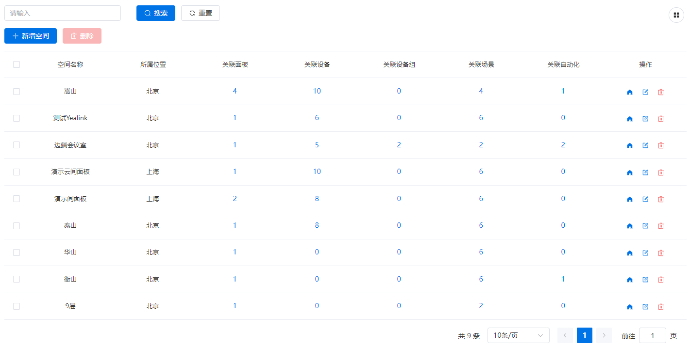
  
  图模式
  
  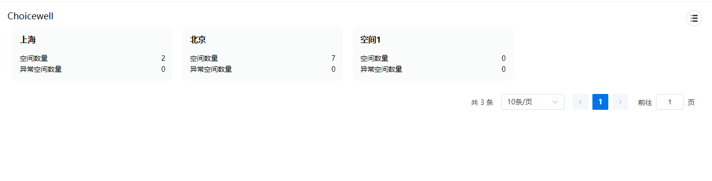
  
  北京层级下
  
  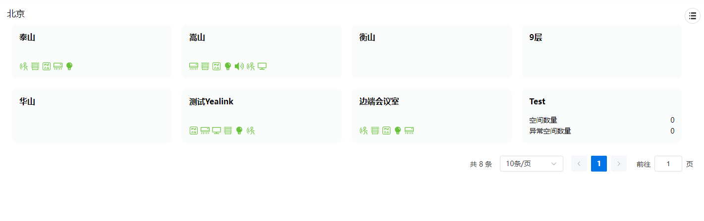
  
  
## 新增空间
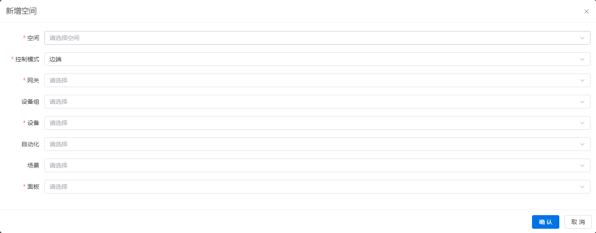

### 空间

- 必选项。
- 数据来源[层级配置](../../tenant/spaceConfig.md)。
- 每个空间只能进行一次新增操作。
### 控制模式
- 必选项；不可更改。
- 边端、云端，默认边端。
- 见[边端控制模式说明](../space.md#边端控制模式)。
### 网关
- 必选项。
- 数据来源自[网关](../device/gateway.md)。
- 当前位置仅能选择和控制该网关下的设备。
- 也可以在此处新增网关。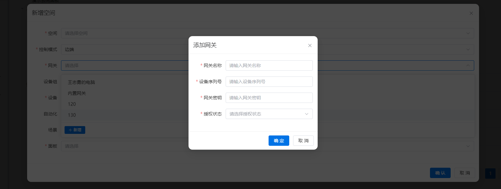
### 设备组
- 非必选。

- 支持直接新增设备组。

- 支持直接修改设备组。

- 数据来源自[设备组](../device/deviceGroup.md)。
 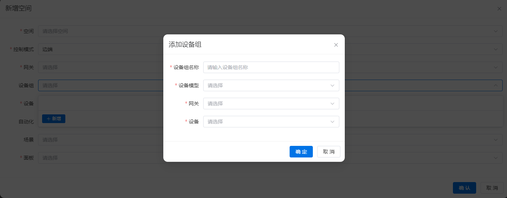

 

### 设备
- 非必选。

- 设备归属于所选的【网关】。

- 数据来源自[子设备](../device/device.md)。

- 可以修改设备的名称、状态和标签。

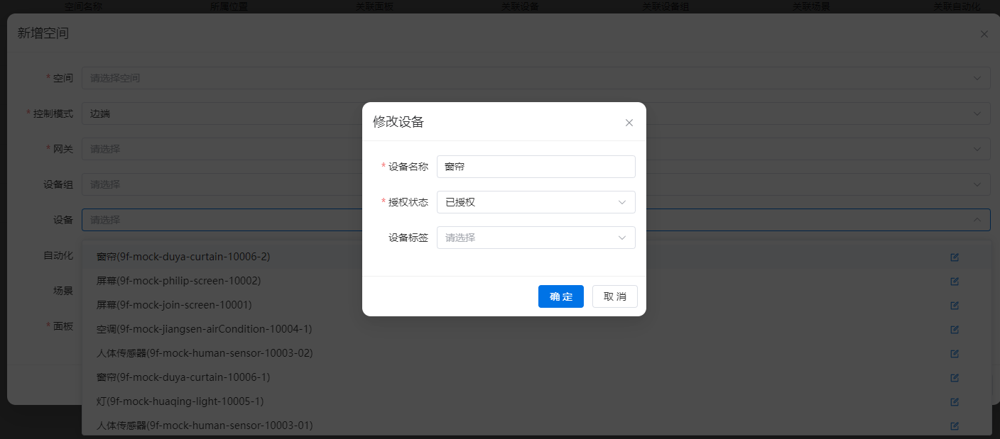

### 场景
- 非必选。

- 支持直接新增场景。

- 支持直接修改场景。

  

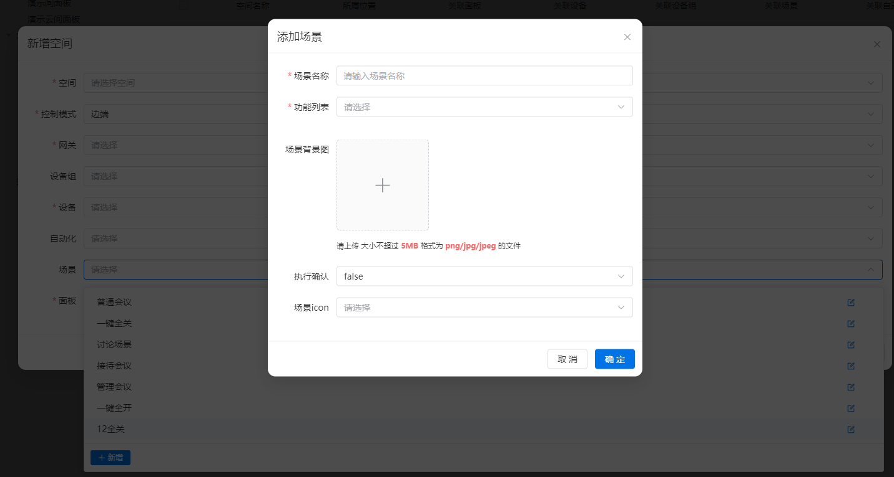

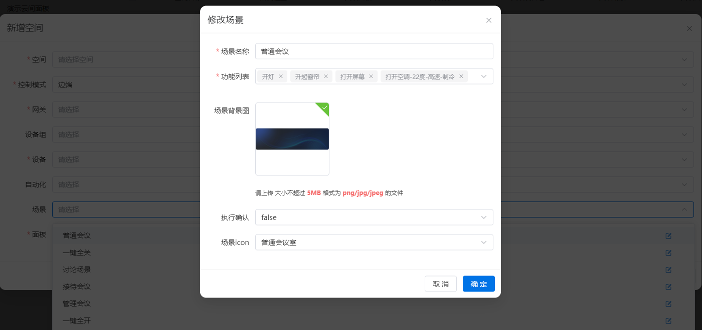

- 数据来源自[场景列表](../control/scene.md)。

### 自动化
- 非必选。
- 支持直接新增自动化。
- 支持直接修改自动化。
  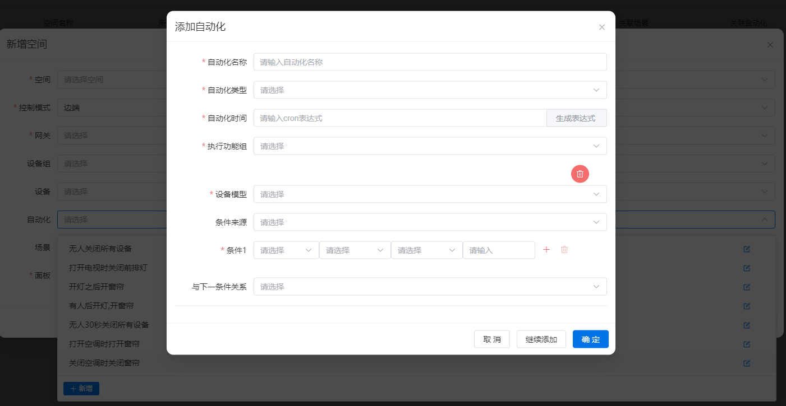
  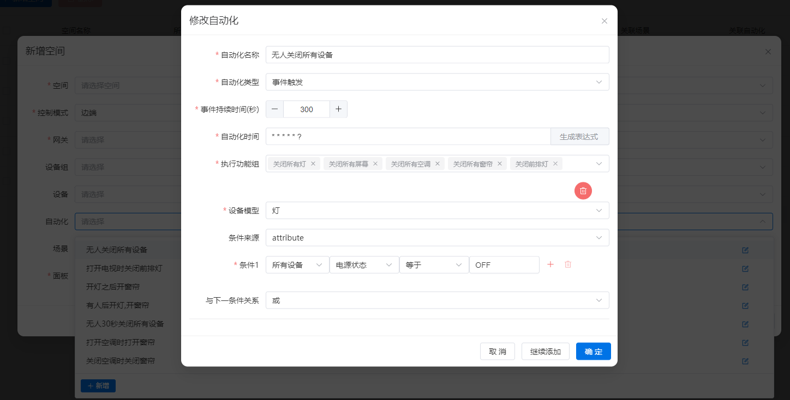
- 数据来源自[自动化列表](../control/automation.md)。
### 面板
- 必选；不可为空；选定的面板未在其他空间中使用。

- 支持修改面板。

- 数据来自于[面板列表](../panel/page.md)

  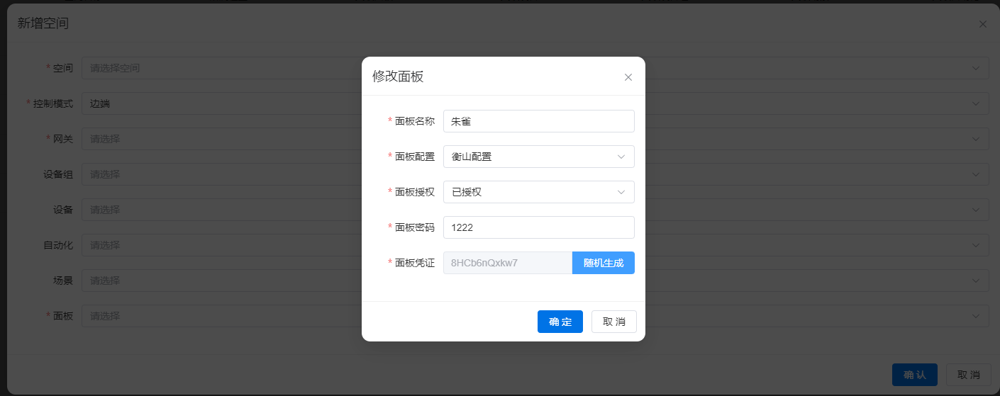

## 修改空间
字段与[新增空间](#新增空间)相同
## 删除空间
支持批量删除。删除后，绑定当前空间内的面板将变成未绑定状态。
## 仪表盘控制
详情查看[仪表盘](../dashboard.md)。
