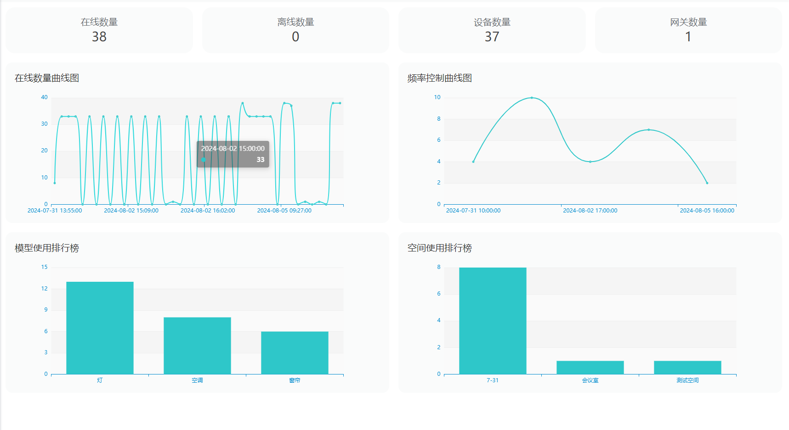
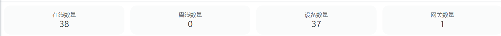
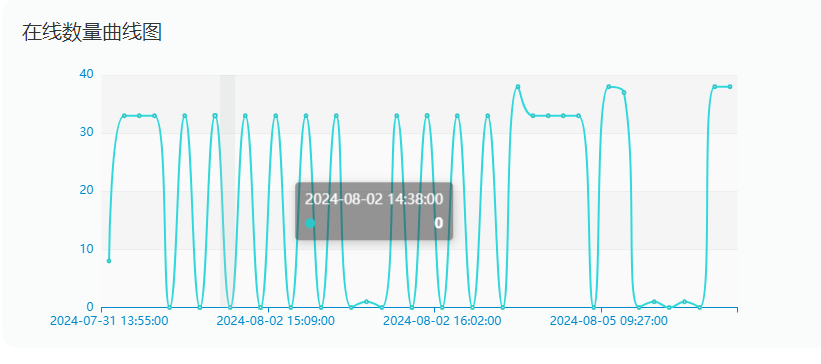
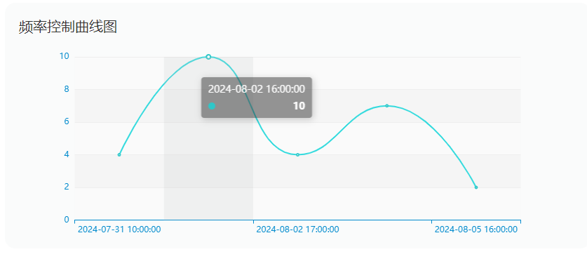
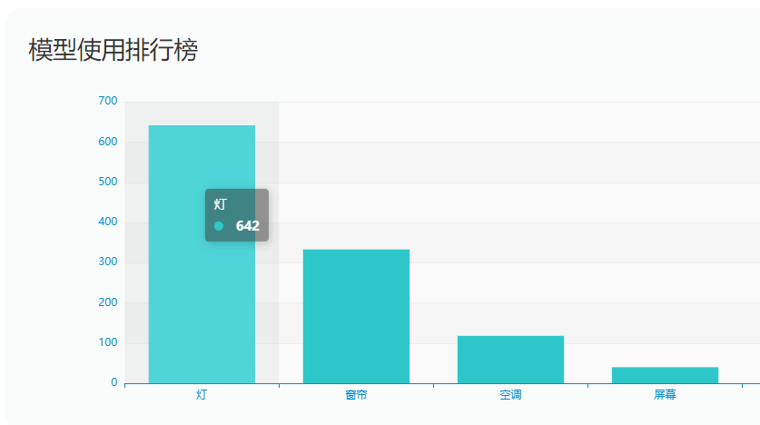
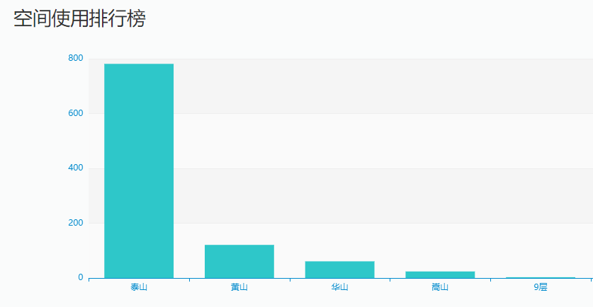

# 数据统计
数据统计功能旨在收集、分析和呈现系统运行和使用过程中的关键数据，以便用户更好地理解系统的性能、优化操作，并作出更明智的决策。以下是智能控制系统数据统计功能的一些特点和目标：
## 特点
### 性能监测
实时追踪系统各个组件的性能指标，如设备状态等，以确保系统运行顺畅。
### 用户行为分析
记录用户的操作和行为，分析他们的偏好和习惯，以改进用户体验，并为个性化服务提供基础。
<!-- ## 能耗统计
 跟踪设备的能耗情况，提供能源消耗的详细报告，协助用户优化能源利用，降低运行成本。 -->

### 报警和异常记录
 记录系统产生的报警和异常事件，为故障排查和问题解决提供支持。
<!-- ## 环境数据分析
 分析传感器收集的环境数据，例如温度、湿度、空气质量等，以便用户了解和改善室内环境。 -->
<!-- ## 场景和自动化效果评估
 评估设定的场景和自动化任务的效果，提供执行结果和用户反馈，以优化自动化策略。 -->
<!-- ## 历史记录和趋势分析
 存储历史数据，并通过趋势分析展示系统运行的演变，帮助用户预测未来的需求和趋势。 -->
### 安全审计
 记录用户访问和权限变更，进行安全审计，以确保系统的安全性和合规性。
### 可视化报告
 提供可视化的报告和图表，使用户能够直观地理解数据，支持决策和管理。

 ## 数据采集
 ### 日志
 记录和存储系统运行、用户操作、异常情况等关键信息的重要组成部分。其目的是提供系统管理员和开发人员详细的运行状态和事件记录，以便追踪问题、进行故障排查、进行性能分析以及确保系统的安全性。
例如网关、子设备、功能组、自动化以及场景的详情中的日志列表。
### 设备数据采集

设备数据采集是指从各种控制设备中获取实时状态、运行参数和其他关键信息的过程。这种数据采集的目的是为了实现对设备的监测、控制和优化，从而提升整个智能控制系统的效能。

采集数据以图表的方式在平台首页展示。

#### 实时状态监测
采集设备的实时在线状态，统计在线数量。

- 在线数量：在线状态的网关和子设备的数量
- 离线数量：离线状态的网管和子设备的数量
- 设备数量：子设备的数量
- 网关数量：网关设备的数量

#### 在线数量曲线图
展示7日内（不含当天）的网关和子设备在线的数量趋势，1小时统计一次。

#### 频率控制曲线
展示7日内（不含当天）设备控制频率的曲线图，只展示有操作记录的时间。

#### 模型使用排行
记录设备操作同时记录操作的设备模型。

展示7日内（不含当天）物模型的使用次数的排名前十。

#### 位置使用排行
记录设备操作同时记录当前设备的所在位置。

展示7日内（不含当天）空间使用次数排行前十。

