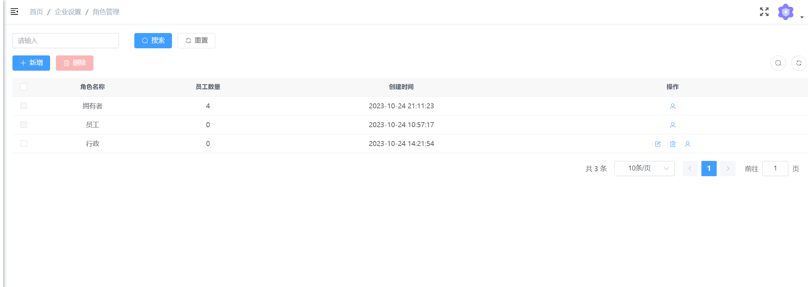
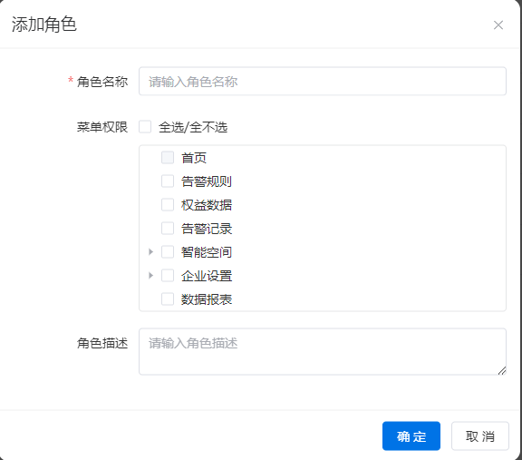
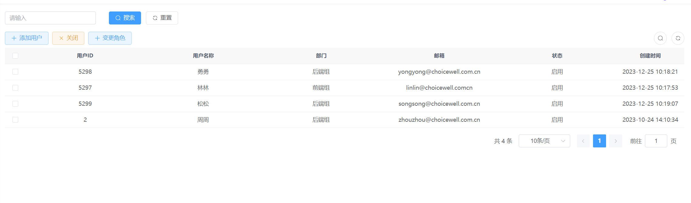
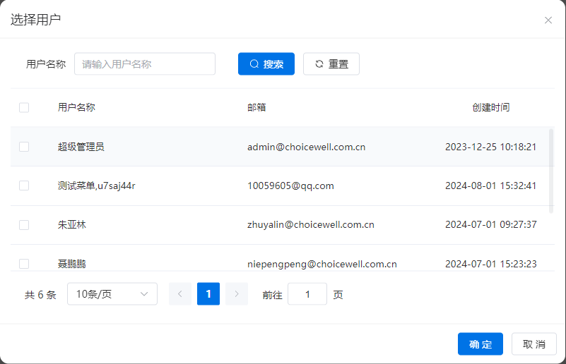
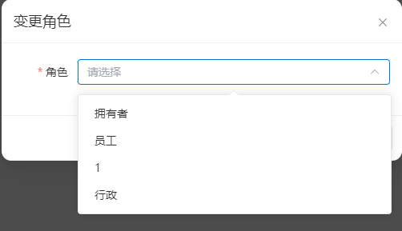

# 角色与权限
## 角色列表
展示所有的角色列表，包括预制角色（拥有者、员工）以及自定义角色
- 角色名称
- 员工数量：角色下员工的数量
- 操作
  - 分配员工：进入分配员工界面
  - 修改：修改角色信息，预制角色不可修改
  - 删除：删除角色，预制角色不可删除
  

## 添加角色
添加角色并且选择角色的权限
- 角色名称：必填

- 菜单权限：非必填，登录后所展示的菜单范围

- 角色描述：非必填
  

  

## 修改角色
表单描述如[添加角色](#添加角色)
## 删除角色
可删除自定义且没有员工的角色

## 分配用户
### 用户列表
展示角色中已有的用户列表，字段结构如[用户管理中用户列表](./user.md#用户列表)

### 角色添加用户
展示非当前角色下的用户的列表，选择用户后变更角色

### 变更角色
选择列表内的多选框，点击【变更角色】按钮，选择其他角色后，用户会自动从当前角色下移除，添加到新角色下

