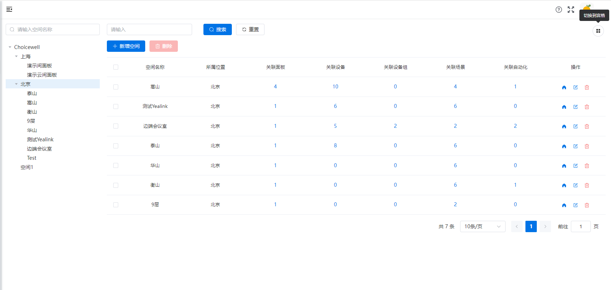

# 层级配置
## 空间列表
- **左侧树形结构：** 展示会议室及以上级的层级结构。

- **右侧列表：** 显示左侧选中节点下所有子层级的详细信息。

  - **层级名称：** 层级的名称，用于平台内展示的空间名称。

  - **层级属性：** 层级的类型，可以是城市、园区、建筑、楼层、区域和会议室。

    - **顶级根节点（位置树）：** 系统的默认节点，仅用于添加子层级，编辑层级。

    - **会议室节点：** 最底层位置，不能再添加子层级，仅可编辑层级和删除层级。

    - **其他位置属性：** 可添加子层级，修改和删除。

      

      

### 操作

操作内容取决于空间属性：

- **修改：** 可编辑层级。如修改上级层级，将会自动调整其子层级的位置。

- **删除：** 删除层级将连带删除其所有子层级。
  - 在智能控制中[使用的层级](../smart/space/space.md)无法删除

- 当新增空间后，该层级将成为一个独立的空间，不再允许添加子层级。空间一旦被定义，其层级将不能再添加任何子层级。

  

  

## 添加层级
- **上级：** 平台内现有的会议室以上的空间树层级结构。
    - 会议室是最底层，无法添加子空间，因此不在此处展示。
- **位置属性：** 属性按照从大到小的顺序依次为城市、园区、建筑、楼层、区域、会议室。
    - 在选择上级空间后，可以添加符合以下范围的子空间：位置树下小于选中空间的任意属性。例如，选择了北京作为上级空间，北京的位置属性为城市，则可以添加的层级包括园区、建筑、楼层、区域和会议室。
- **层级名称：** 除了城市外，可自定义命名，建议使用具有意义和易于理解的文字，便于记忆。

添加行政区如下图所示：

