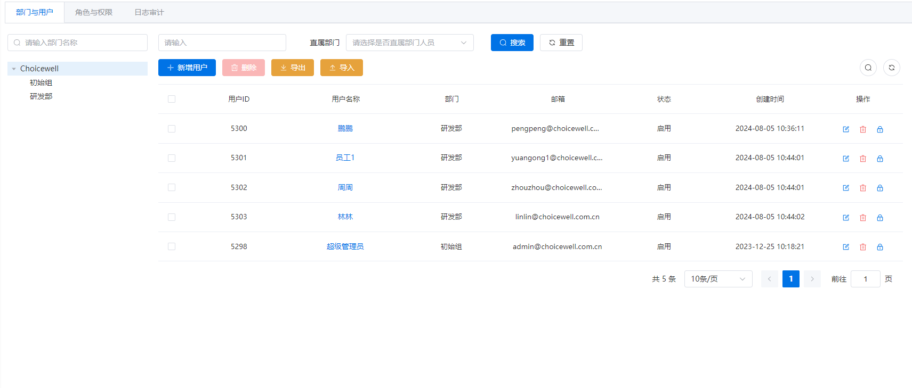
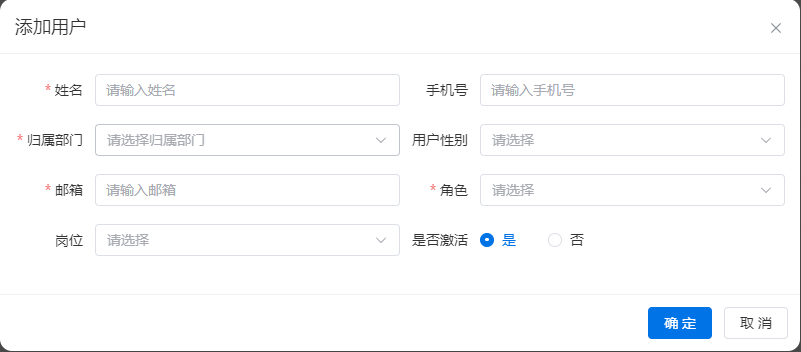

# 用户管理
## 用户列表
左侧展示部门树，可通过部门名称筛选；右侧展示部门列表，可通过用户姓名、邮箱搜索，可以选择只查询直属部门的员工，分页展示。
- 用户ID: 用户在平台内的唯一标识
- 用户姓名：用户的真实姓名，用于平台内的展示
- 部门：用户的直属部门
- 邮箱：用户的邮箱，用于接收邮件使用
- 状态：启用、停用
- 创建时间：用户的创建时间
- 操作：包括修改和删除操作

## 添加用户
当已有用户数量不超过系统通行证中用户数量时，可添加新的用户。
- 姓名：必填
- 用户密码：必填
- 归属部门：必选
- 用户性别：选填
- 邮箱：必填；唯一
- 角色：必选，是当前账号有权限选择的角色（以下条件符合一个即可）：
  - 当前角色与选择的角色相同
  - 当前角色是超级管理员
  - 当前角色是预制角色
  - 当前角色是所选角色的父级角色
- 岗位：非必填
- 是否激活：非必填，默认为不激活

添加用户后邮箱即为登录账号，密码为用户设置的密码。

## 修改用户
不可修改密码外，其他表单与[添加用户](#添加用户)相同
修改邮箱后，登录账号依然是修改之前的地址，不会跟着邮箱的变化而改变。

## 删除用户
 不可删除当前登录的用户

