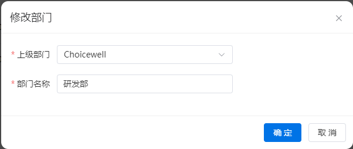

# 部门管理
以树形结构展示部门层级关系，将组织架构清晰呈现，包含创建、调整人员分配等标准功能，对公司内不同部门进行结构化和有效的管理。

## 部门展示与搜索

可以添加部门以及搜索不同部门的信息。

## 添加部门
可以通过上图中的新增按钮添加，也可以给指定的部门添加子部门。表单结构如下：
- 上级部门：必选；单选
- 部门名称：必填；单行文本

## 修改部门
对于部门的上级部门和名称进行修改。

## 删除部门
当部门没有成员并且没有子部门时，可以直接删除。否则需要先移出部门成员并且删除所有的子部门。

